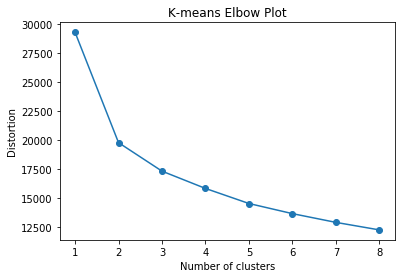

Whle at Insight, I had the opportunity to create a data science project that demonstrates my ability to perform an analysis that creates business value within a short timeframe (about three weeks), simulating how data science operates in an industry setting. For this project I consulted with [Zendo Tools](http://zendo.tools/), a company with an app that helps to track a user's meditation progress. 

The Zendo Tools app is used in conjunction with an Apple watch to record the user's meditation session. Afterwards, the app shows how the person's heart rate, heart rate variability, and motion changed throughout the session. It also compares these metrics across all of the meditation sessions. [Heart rate variability](http://zendo.tools/research) is a metric of particular interest because it is known to be associated with a variety of measures of health and well-being and can potentially be improved with meditation.

Zendo Tools was interested in creating a product feature that reports to users when they were in the meditative state during their meditation sessions. This additional feedback would be useful because it gives users more information that can be used to improve on subsequent meditation sessions.

```python
segment_len = 3
slide_len = 1
segments = []

for i in df_list:
    for start_pos in range(0, len(i), slide_len):
        end_pos = start_pos + segment_len
        segment = np.copy(i[start_pos:end_pos])
        if len(segment) != segment_len:
            continue
        segments.append(segment)
```
A

```python
from sklearn.cluster import KMeans

distortions = []
for i in range(1, 9):
    km = KMeans(n_clusters=i, random_state=0)
    km.fit(segments_array_2d)
    distortions.append(km.inertia_)

plt.plot(range(1, 9), distortions, marker='o')
plt.title('K-means Elbow Plot')
plt.xlabel('Number of clusters')
plt.ylabel('Distortion');
```


A

```python
df_meditation_list = []

for index, i in enumerate(df_list):
    if index < 13:
        continue
    if index > 120:
        if ((i.motion > .2).any() or (i.motion_change > .2).any() or (i.sdnn_diff_bl < 0).any() 
            or (i.hr_diff_bl > .95).any() or (i.hr_pct_change > .95).any() or (i.hr_pct_change < .05).any()):
            continue
        else:
            df_meditation_list.append(i)
    else:
        if ((i.motion > .2).any() or (i.motion_change > .2).any() or (i.sdnn_diff_bl < 10).any() 
            or (i.hr_diff_bl > .75).any() or (i.hr_pct_change > .75).any() or (i.hr_pct_change < .25).any()):
            continue
        else:
            df_meditation_list.append(i)
```

[zendo-analyzer](https://zendo-analyzer.herokuapp.com/)
