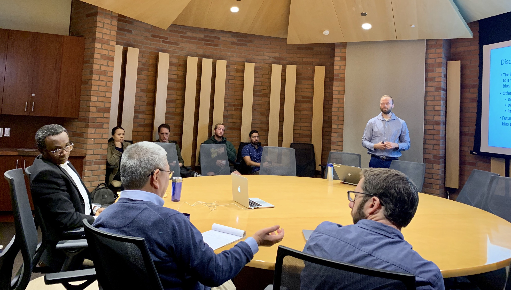

In May 2019 I graduated with my PhD in Epidemiology at UCLA. During my PhD, I studied the language and statistics of causation, learning how to answer questions of whether A caused B and with what strength. My dissertation involved innovating in a sub-field of causal inference known as bias analysis. I found this area particularly attractive because it allows for greater transparency in epidemiological studies. Instead of simplying positing that one or more biases may be impacting one's results, it forces researchers to quantify these assumptions. Ultimately, the reader is able to use this information in conjunction with a p-value or confidence interval to understand how robust a causal estimate really is.  

Upon graduating, I moved to San Francisco to participate in the Health Data Science Fellowship through [Insight Data Science](https://www.insightdatascience.com).

Throughout all these experiences, I've had a strong passion for baseball statistics and fantasy baseball.
